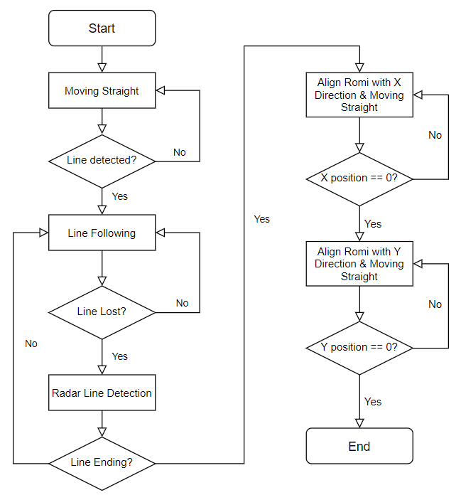

# Romi Arduino
Using Romi to accomplish the line-following task. [Video](https://www.youtube.com/watch?v=sB2IH_WiKx8&t=10s)

Note: Sorry about the delayed recording, the Romi started from the centre of the blue circle.

## Task List:
- [x] Going Straight and Detect the Line;
- [x] Line Following;
- [x] Line End Detection;
- [x] Going Home;
- [x] Stop within the Blue Circle

## Map

## Flow Chart

